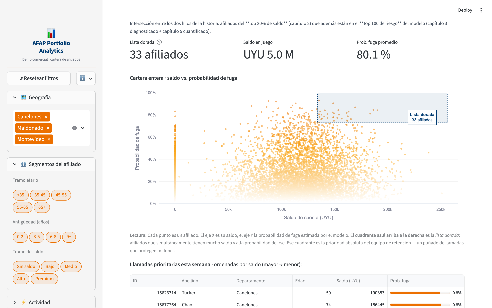

# AFAP Portfolio Analytics


Demo end-to-end de analítica comercial sobre cartera de afiliados a una
administradora previsional (Bank Customer Churn de Kaggle, 10 k clientes,
reframeado al vocabulario AFAP). Proyecto de portafolio para el puesto
**Analista de Datos Junior — Equipo Comercial en AFAP Itaú**.

**Demo en vivo:** https://mathiasmtt-afap-portfolio-analytics-appstreamlit-app-gdnizo.streamlit.app

## Screenshots del dashboard



## Sobre el dataset

El proyecto utiliza un dataset público de churn bancario europeo como
proxy del problema de retención de afiliados. La estructura del dato
(cliente con saldo, productos, antigüedad, segmento demográfico y target
de fuga) es funcionalmente equivalente al sistema de información
comercial de una AFAP. Esto permite construir un demo reproducible sin
acceso a datos sensibles.

Reframe canónico (documentado en `src/data_loader.py`):

| Origen bancario | Vocabulario AFAP |
|---|---|
| `CustomerId` | `afiliado_id` |
| `CreditScore` | `score_interno` |
| `Geography` (France / Germany / Spain) | `departamento` (Montevideo / Canelones / Maldonado) |
| `Balance` | `saldo_cuenta` (UYU) |
| `NumOfProducts` | `productos_contratados` |
| `IsActiveMember` | `aportante_activo` |
| `Exited` | `traspaso` |

## 3 insights reales medidos en el notebook

### 1) Concentración de cartera

```
Top 20 % afiliados   →  40,2 % del saldo administrado
Top 50 % afiliados   →  85,7 % del saldo administrado
```
**Acción comercial:** programa de retención premium para el top 20 %;
un traspaso ahí pesa lo mismo que varios del segmento bajo.

### 2) Perfil de fuga

```
Tasa de fuga global:   20,4 %
Canelones:             32,4 %   ⬅ el doble de la media
Montevideo:            16,2 %
Maldonado:             16,7 %
Inactivos:             26,9 %   vs   Activos: 14,3 %
```
**Acción comercial:** focalizar campañas en Canelones + producto de
reactivación para aportantes inactivos.

### 3) La edad es el predictor dominante

```
<35 años:    7,9 %
35-45 años: 17,7 %
45-55 años: 48,1 %   ⬅ pico
55-65 años: 49,8 %   ⬅ proximidad al retiro = fuga
65+ años:   15,2 %
```
**Acción comercial:** programa de educación financiera y asesoría
personalizada al cruzar los 45.

### (Bonus) Modelo de scoring interpretable

Regresión logística entrenada sobre el dataset completo produce un
ranking de afiliados por probabilidad de fuga, junto con los drivers
más influyentes (coeficientes ordenados por magnitud). La elección de
logística sobre XGBoost es deliberada: **el equipo comercial necesita
explicar por qué un afiliado está en riesgo, no maximizar AUC**.

## Arquitectura

```
afap-itau/
├── app/
│   └── streamlit_app.py          # Capa de presentación
├── data/
│   └── raw/                      # Customer-Churn-Records.csv
├── notebooks/
│   └── 01_insights_comerciales.ipynb
├── src/
│   ├── data_loader.py            # Carga + validación + reframe bancario→AFAP
│   ├── analytics.py              # KPIs, Pareto, segmentación, cohortes (puro)
│   ├── models/churn_logit.py     # Logística interpretable + scoring
│   └── reporting.py              # Excel multi-hoja
├── sql/                          # DuckDB — paridad con src/analytics.py
├── tests/                        # 105 tests, fixtures sintéticas
├── .github/workflows/ci.yml      # ruff + pytest
├── .streamlit/config.toml
└── pyproject.toml
```

**Principio de diseño no negociable:** notebook, app Streamlit, scripts
SQL y generador de Excel **consumen las mismas funciones de `src/`**.
Un único lugar donde corregir un bug se propaga a todos los consumidores.

## Paleta visual — AFAP Itaú

Extraída del sitio corporativo:

```bash
curl -s https://www.afap.itau.com.uy/ | grep -oE '#[0-9a-fA-F]{6}' | sort | uniq -c | sort -rn
```

| Uso | HEX |
|---|---|
| Primario (naranja Itaú) | `#EC7000` |
| Azul corporativo | `#003B71` |
| Naranja secundario | `#FAA61A` |
| Gris neutro | `#D2D2D2` |
| Texto | `#32373C` |

Se centralizan como constantes en `app/streamlit_app.py`.

## Setup y uso

```bash
# 1) Descargar el dataset de Kaggle (Bank Customer Churn)
#    y colocarlo en: data/raw/Customer-Churn-Records.csv

# 2) Instalar dependencias
uv sync --extra dev

# 3) Tests + lint
uv run ruff check .
uv run pytest -q

# 4) Notebook de insights
uv run jupyter notebook notebooks/01_insights_comerciales.ipynb

# 5) Dashboard
uv run streamlit run app/streamlit_app.py
```

## Tests

105 tests con fixtures sintéticas (no dependen del CSV real). Cubren:

- Validación y reframe (`test_data_loader.py`).
- KPIs, Pareto, segmentaciones, cohortes, heatmap, variación
  (`test_analytics.py`, 30+ tests).
- Modelo logístico, scoring y drivers (`test_models.py`).
- Generación de Excel multi-hoja (`test_reporting.py`).
- Paridad SQL/Python sobre DuckDB (`test_sql_parity.py`).

CI: ruff + pytest en cada push/PR (ver `.github/workflows/ci.yml`).

## Stack técnico

| Capa | Herramienta |
|---|---|
| Entorno | `uv` |
| Análisis | `pandas`, `numpy` |
| SQL | `duckdb` |
| Modelado | `scikit-learn` (LogisticRegression) |
| Visualización | `plotly` |
| Dashboard | `streamlit` |
| Excel | `openpyxl` |
| Tests | `pytest` + fixtures sintéticas |
| Lint | `ruff` |
| CI | GitHub Actions |

## Roadmap post-MVP

- [ ] CLI con `argparse` (`python -m afap_analytics monthly-report --month 2025-10`).
- [ ] Exportación a PDF.
- [ ] Alertas automáticas SMTP con top-N afiliados en riesgo semanal.
- [ ] Forecasting de saldo administrado por cohorte.
- [ ] Integración con dataset BCU público de comisiones AFAP para
      benchmarking competitivo.

## Referencias

- **Dataset:** [Bank Customer Churn — Kaggle](https://www.kaggle.com/datasets/radheshyamkollipara/bank-customer-churn)
- **Marco regulatorio uruguayo:** [Ley 16.713](https://www.impo.com.uy/bases/leyes/16713-1995)
- **Regulador:** [BCU — Superintendencia de Servicios Financieros](https://www.bcu.gub.uy/)
- **Empresa target:** [AFAP Itaú](https://www.afap.itau.com.uy/)

## Licencia

MIT — ver [LICENSE](LICENSE).
